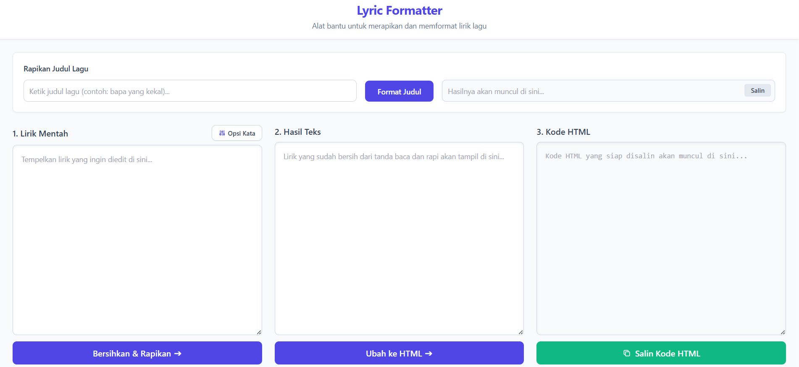

# 🚀 Lyric Formatter (Web App)

A lightweight, client-side web tool built with Vanilla JS & Tailwind CSS to format song lyrics. Features include automated capitalization (EYD), punctuation removal, and HTML conversion.

## ✨ Key Features

* **Title Formatting:** Automatically converts raw song titles into Capital Each Word format.
* **Smart Capitalization (EYD):** Corrects capitalization at the beginning of each line and for specific words (like Tuhan, Allah, etc.) using checkbox configurations or custom vocabulary input.
* **Punctuation Cleaning:** Removes unnecessary punctuation marks (commas, periods, semicolons) from raw lyrics.
* **HTML Conversion:** Converts accented characters (e.g., á, è) into HTML entities and automatically appends `<br />` tags to the end of every line.
* **One-Click Copy:** Quick copy buttons for both the title and the final HTML code, complete with visual success indicators.
* **Responsive UI:** A modern, fully responsive interface built with Tailwind CSS.

## 💻 Application Preview


*Home page.*

## 🛠️ Tech Stack

The main technologies used in this project include:

* **Frontend:**
    * HTML5
    * Vanilla JavaScript
    * Tailwind CSS (via CDN)

*This is a client-side only application and does not require a backend or database.*

## ⚙️ Installation & Setup

Follow these steps to get the project running on your local machine:

1.  **Clone this repository:**
    ```bash
    git clone https://github.com/fandipres/lyric-formatter.git
    cd lyric-formatter
    ```

2.  **Run the application:**
    
    No special installation is needed. Simply open the `index.html` file in your web browser.
    ```bash
    # On Windows
    start index.html

    # On macOS
    open index.html
    ```

3.  The application should now be running in your browser.

## 🔗 Links

* **Live Demo:** [fandipres.github.io/lyric-formatter](https://fandipres.github.io/lyric-formatter)
* **Repository:** [github.com/fandipres/lyric-formatter](https://github.com/fandipres/lyric-formatter)

## 📄 License

This project is licensed under the [MIT License](https://opensource.org/licenses/MIT).